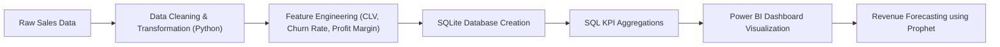

# Retail KPI Intelligence Dashboard  
### End-to-End Business Analytics & Revenue Forecasting Project  

## Project Overview

This project is a complete end-to-end Retail Business Intelligence solution designed to simulate how a real retail organization monitors performance, analyzes customer behavior, optimizes product profitability, and forecasts future revenue.

The system integrates:
- Data Cleaning & Feature Engineering (Python)
- SQL-based KPI Analysis
- Interactive Power BI Dashboards
- Time-Series Forecasting using Prophet

This project demonstrates the ability to combine analytics, business thinking, and predictive modeling into a production-style workflow.

## Business Problem

Retail companies often struggle with:
- Revenue fluctuations across regions
- Inconsistent profit margins across product categories
- High customer churn impacting long-term growth
- Lack of forward-looking revenue projections

The goal was to build a centralized intelligence system to solve these challenges.

## Tools & Technologies Used

- **Python** (Pandas, NumPy, Prophet)
- **SQL (SQLite)**
- **Power BI**
- **Matplotlib / Seaborn**
- **Git & GitHub**

##  Data Pipeline Architecture

## Dashboard Modules

### 1. Executive Business Intelligence
- Total Revenue: 2.26M
- Total Profit: 392K
- Profit Margin: 17.35%
- Churn Rate: 25.47%
- Revenue by Region & Segment
- Year-over-Year Growth Trend

Purpose: Executive-level performance monitoring.

### 2. Customer Intelligence Dashboard
- Total Customers vs Active vs Churned
- Customer Lifetime Value (CLV) Ranking
- Monthly Customer Growth Trend
- Segment-wise Revenue Analysis

Purpose: Identify high-value customers and churn risk segments.

### 3. Product Performance Intelligence
- Revenue by Product & Category
- Subcategory Profit Margin Analysis
- Low-Margin Product Identification
- Top Performing Products

Purpose: Improve profitability through product-level insights.

### 4️. Revenue Forecasting & Strategic Projection
- Monthly Revenue Aggregation
- Time-Series Forecasting using Prophet
- 3-Month Future Projection
- Confidence Intervals

Purpose: Enable forward-looking strategic decisions.

## Key Insights

- Technology segment contributes highest revenue.
- ~25% customer churn indicates retention risk.
- Several subcategories operate under low-margin thresholds.
- Revenue shows steady historical growth trend.
- Forecast model predicts continued growth (subject to market stability).

## Business Recommendations

- Improve retention strategies for high CLV customers.
- Reprice or discontinue low-margin products.
- Increase investment in high-performing segments.
- Implement churn monitoring dashboard for proactive action.
- Use forecast outputs for quarterly inventory planning.

## Skills Demonstrated

- Data Cleaning & Transformation
- Feature Engineering (CLV, Churn, Margin)
- SQL KPI Aggregation Queries
- Dashboard Design & Business Storytelling
- Time-Series Forecasting (Prophet)
- End-to-End Analytics Workflow Design

## Forecasting Model Details

- Model Used: Facebook Prophet
- Data Aggregation: Monthly Revenue
- Output: 3-Month Revenue Forecast
- Includes: Trend + Confidence Intervals

## Why This Project Matters

This project goes beyond simple dashboard creation.  
It demonstrates:

✔ Business understanding  
✔ Technical depth (SQL + Python + BI)  
✔ Predictive analytics capability  
✔ Data storytelling  
✔ Production-style workflow  

It simulates how real organizations build decision-support systems.
